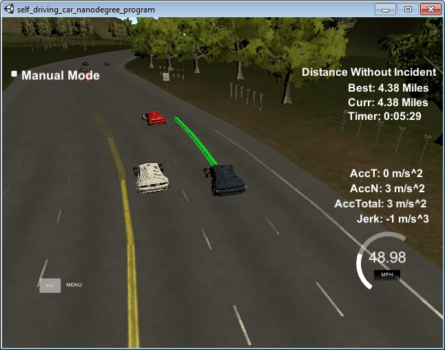

# CarND-Path-Planning-Project
Self-Driving Car Engineer Nanodegree Program
   
### Simulator.
You can download the Term3 Simulator which contains the Path Planning Project from the [releases tab (https://github.com/udacity/self-driving-car-sim/releases/tag/T3_v1.2).

### Goals
In this project your goal is to safely navigate around a virtual highway with other traffic that is driving +-10 MPH of the 50 MPH speed limit. You will be provided the car's localization and sensor fusion data, there is also a sparse map list of waypoints around the highway. The car should try to go as close as possible to the 50 MPH speed limit, which means passing slower traffic when possible, note that other cars will try to change lanes too. The car should avoid hitting other cars at all cost as well as driving inside of the marked road lanes at all times, unless going from one lane to another. The car should be able to make one complete loop around the 6946m highway. Since the car is trying to go 50 MPH, it should take a little over 5 minutes to complete 1 loop. Also the car should not experience total acceleration over 10 m/s^2 and jerk that is greater than 10 m/s^3.

#### The map of the highway is in data/highway_map.txt
Each waypoint in the list contains  [x,y,s,dx,dy] values. x and y are the waypoint's map coordinate position, the s value is the distance along the road to get to that waypoint in meters, the dx and dy values define the unit normal vector pointing outward of the highway loop.

The highway's waypoints loop around so the frenet s value, distance along the road, goes from 0 to 6945.554.

## Basic Build Instructions

1. Clone this repo.
2. Make a build directory: `mkdir build && cd build`
3. Compile: `cmake .. && make`
4. Run it: `./path_planning`.

Here is the data provided from the Simulator to the C++ Program

#### Main car's localization Data (No Noise)

["x"] The car's x position in map coordinates

["y"] The car's y position in map coordinates

["s"] The car's s position in frenet coordinates

["d"] The car's d position in frenet coordinates

["yaw"] The car's yaw angle in the map

["speed"] The car's speed in MPH

#### Previous path data given to the Planner

//Note: Return the previous list but with processed points removed, can be a nice tool to show how far along
the path has processed since last time. 

["previous_path_x"] The previous list of x points previously given to the simulator

["previous_path_y"] The previous list of y points previously given to the simulator

#### Previous path's end s and d values 

["end_path_s"] The previous list's last point's frenet s value

["end_path_d"] The previous list's last point's frenet d value

#### Sensor Fusion Data, a list of all other car's attributes on the same side of the road. (No Noise)

["sensor_fusion"] A 2d vector of cars and then that car's [car's unique ID, car's x position in map coordinates, car's y position in map coordinates, car's x velocity in m/s, car's y velocity in m/s, car's s position in frenet coordinates, car's d position in frenet coordinates. 

## Details

1. The car uses a perfect controller and will visit every (x,y) point it recieves in the list every .02 seconds. The units for the (x,y) points are in meters and the spacing of the points determines the speed of the car. The vector going from a point to the next point in the list dictates the angle of the car. Acceleration both in the tangential and normal directions is measured along with the jerk, the rate of change of total Acceleration. The (x,y) point paths that the planner recieves should not have a total acceleration that goes over 10 m/s^2, also the jerk should not go over 50 m/s^3. (NOTE: As this is BETA, these requirements might change. Also currently jerk is over a .02 second interval, it would probably be better to average total acceleration over 1 second and measure jerk from that.

2. There will be some latency between the simulator running and the path planner returning a path, with optimized code usually its not very long maybe just 1-3 time steps. During this delay the simulator will continue using points that it was last given, because of this its a good idea to store the last points you have used so you can have a smooth transition. previous_path_x, and previous_path_y can be helpful for this transition since they show the last points given to the simulator controller with the processed points already removed. You would either return a path that extends this previous path or make sure to create a new path that has a smooth transition with this last path.


## Rubrics points

* The code compiles correctly using Basic Build Instructions, as descibed above

* Valid Trajectories: 

  * The car is able to drive at least 4.32 miles without incident: car was test for 12+ miles without any incident.

  * The car drives according to the speed limit.: car move with speed below 50 mile/hr as through the test duration.

  * Max Acceleration and Jerk are not Exceeded.: Car does not exceed max jerk or acceleration. Tangential acceleration was set 0.1 m/s^2(=0.225 mile/hrs^2) with result in max change velocity, per tragectory waypoint generated, of 0.1*dt= 0.002 m/s, ( as dt=0.02 s). 

  * Car does not have collisions.: car does not collide with other cars and maneuvers with safe distance from other cars

  * The car stays in its lane, except for the time between changing lanes.: as the out of lane warning never flashes in the simulator, during the test run.

  * The car is able to change lanes: car is able to change lane when other car is in front and sufficient space in one of the side lanes.
  
  


## Reflection

The code mainly utilizes the data provided by the simulator to generate the trajectory waypoints. High level understanding of the code involves three main modules prediction(utilizing sensor-fusion data from simulator)

### Prediction and sensor-fusion data analysis [line 260 to 303](./src/main.cpp#L260)
This part of the code, analyses the sensor data and Outputs. Which of the three lanes have other cars nearest to our test(ego) car. This is boolean output for 30 meters in front and 15 meters in rear directions for all lane. Output data of this section of the code also inculdes the velocity and fernet coordinate s-positions of the other nearest cars. 

### Behavior planning[line 307 to 347](./scr/main.cpp#L307)
This module of the code, uses the data output by previous module. To Output the next lane, our test car should choose. If the current lane has a slow moving car in front. Then other lanes(left and right or only left/right) are check for front and rear cars. And if safe space is available new lane Output is decided (by first checking left and right). But if there the no safe space, then our test car will slow down and maintain a buffer distance with the front car.

### Waypoint Trajectory generation [line 349 to 465](./scr/main.cpp#L349)
50 waypoints are sent to the simulator on every call to lambda function `h.onMessage[]()`. previous point returned by simulator, appended with the new point generated based on input lane received by previous module of code `Behavior planning`. 
Spline [Cubic Spline interpolation implementation](http://kluge.in-chemnitz.de/opensource/spline/)  is used in this section. To generate smooth waypoint at time interval of 20ms, using 5 setup points in the car coordinate system, with y-car-coordinate expressed in terms of x-car-coordinate in spline function.
( Note: Various other approaches such as, expressing x-global and y-coordinate in terms of s was also tried that did not yield better results.  )
Futher x-car-coordinate is incremented by the velocity component in the direction of x-car-coordinate. y-car-coordinate is generated using the spline previously setup. Next before adding these new points to the waypoint vectors, car-coordinates are transformed to global-coordinate for the simulator as input.
Velocity/speed is also gradually updated(if required increased/decreased) during each set of waypoint coordinated generation.


---

## Dependencies

* cmake >= 3.5
  * All OSes: [click here for installation instructions](https://cmake.org/install/)
* make >= 4.1
  * Linux: make is installed by default on most Linux distros
  * Mac: [install Xcode command line tools to get make](https://developer.apple.com/xcode/features/)
  * Windows: [Click here for installation instructions](http://gnuwin32.sourceforge.net/packages/make.htm)
* gcc/g++ >= 5.4
  * Linux: gcc / g++ is installed by default on most Linux distros
  * Mac: same deal as make - [install Xcode command line tools]((https://developer.apple.com/xcode/features/)
  * Windows: recommend using [MinGW](http://www.mingw.org/)
* [uWebSockets](https://github.com/uWebSockets/uWebSockets)
  * Run either `install-mac.sh` or `install-ubuntu.sh`.
  * If you install from source, checkout to commit `e94b6e1`, i.e.
    ```
    git clone https://github.com/uWebSockets/uWebSockets 
    cd uWebSockets
    git checkout e94b6e1
    ```
